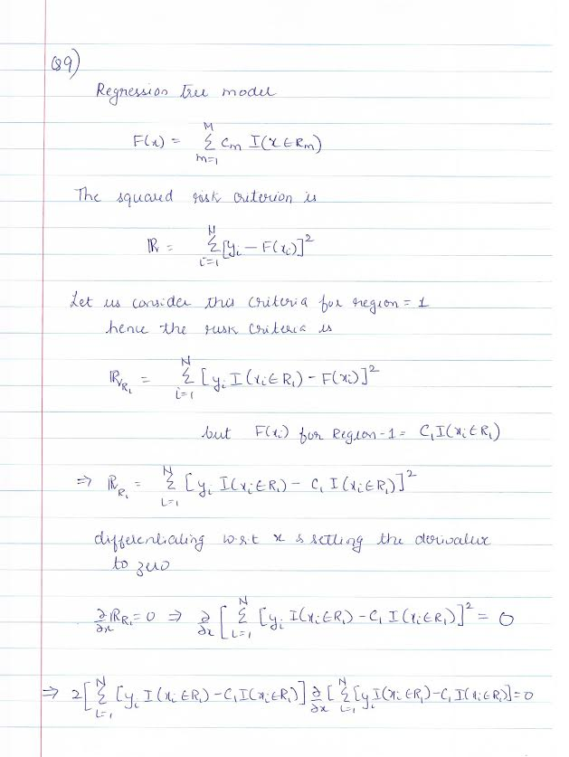
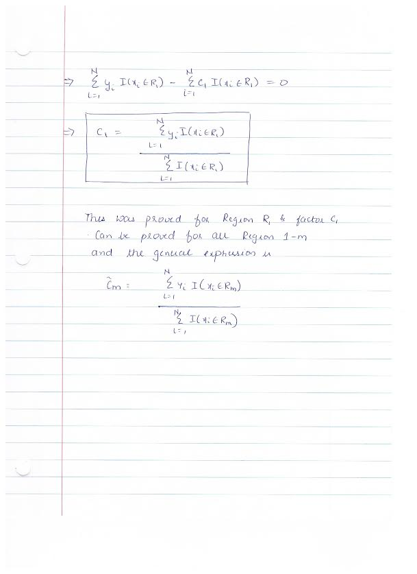
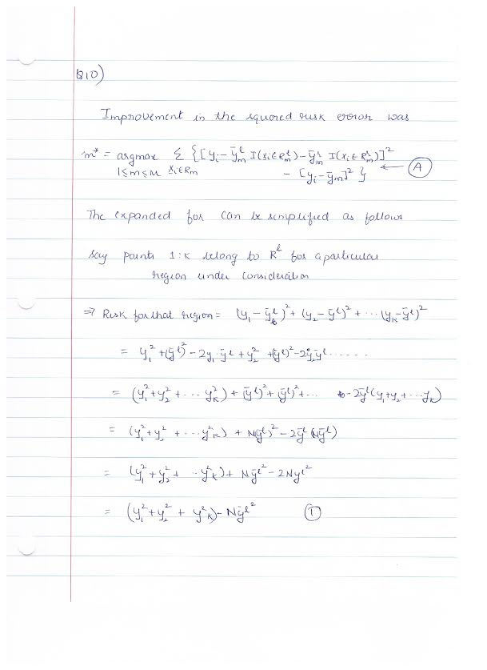
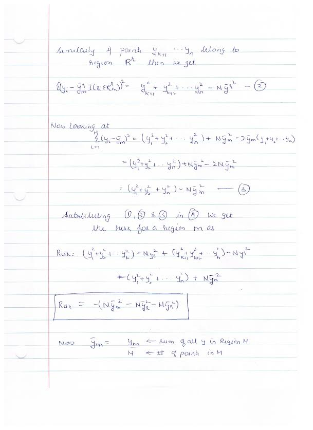
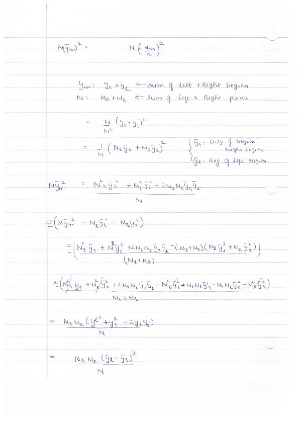
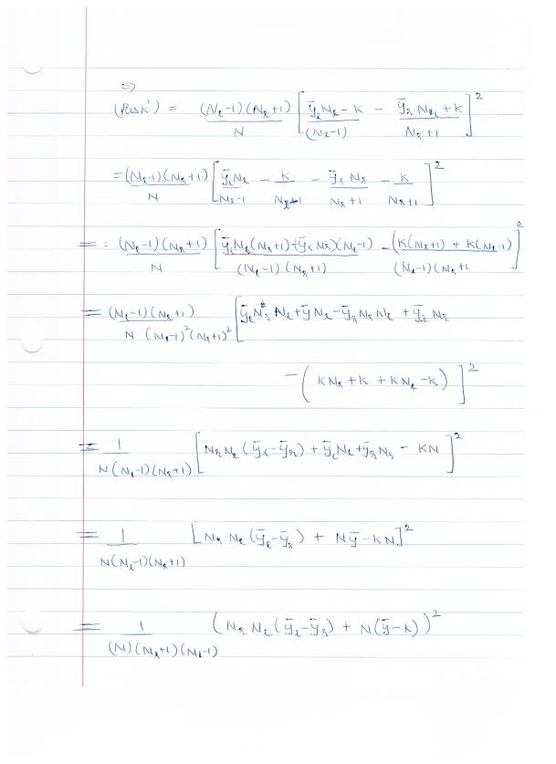
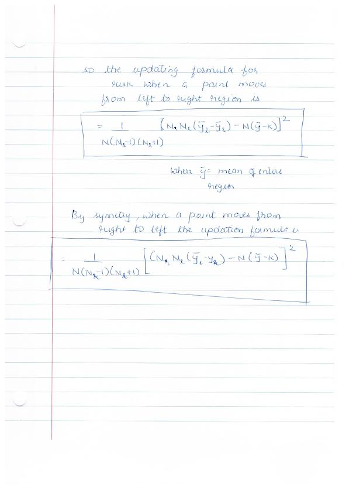

1. Q1

```{r}
library(rpart)
    Income=read.csv("Income_Data.txt")
    ModIncome=data.frame(Inc=Income$X9,sex=Income$X2,marital=Income$X1,age=Income$X5,edu=Income$X4,occ=Income$X5.1,dwelltime=Income$X5.2,dual=Income$X3,hh=Income$X3.1,hh18=Income$X0,house=Income$X1.1,hometype=Income$X1.2,Ethnic=Income$X7,lang=Income$NA.)
    
    Inc=factor(ModIncome$Inc, levels=1:9, labels=c("<10K","10-15K","15-20K","20-25K","25-30K","30-40K","40-50K","50K-75K",">75K"))
    sex=factor(ModIncome$sex, levels=1:2, labels=c("Male","Female"))
    marital=factor(ModIncome$marital, levels=1:5,labels=c("Married","live-in","Divorced","Seperated","Single"))
    age=factor(ModIncome$age,levels=1:7,labels=c("14-17","18-24","25-34","35-44","45-54","55-64","over 65"))
    edu=factor(ModIncome$edu,levels=1:6,labels=c("less grade 8","grade 9-11","grad high","1-3 college","College grad","Grad"))
    occ=factor(ModIncome$occ,levels=1:9,labels=c("Professional","Sales","laborer","Clerk","Home","Student","Military","Retired","Unemployed"))
    dwelltime=factor(ModIncome$dwelltime,levels=1:5,labels=c("<1year","1-3 years","4-6 years","7-10 years",">10 years"))
    dual=factor(ModIncome$dual, levels=1:3, labels=c("Not Married","Yes","No"))
    hh=factor(ModIncome$hh, levels=1:9, labels=c("1","2","3","4","5","6","7","8",">9"))
    hh18=factor(ModIncome$hh18, levels=1:9, labels=c("1","2","3","4","5","6","7","8",">9"))
    house=factor(ModIncome$house, levels=1:3, labels=c("Own","Rent","Live with family"))
    hometype=factor(ModIncome$house,levels=1:5, labels =c("House","Condo","Apa","Mobile","Other"))
    ethnic=factor(ModIncome$Ethnic, levels=1:8, labels=c("American Ind","Asian","Black","East indian","Hispanic","Pacific Island","White","Other"))
    lang=factor(ModIncome$lang,levels=1:3, labels=c("English","Spanish","Other"))
    
    FinalInc=data.frame(Inc=Inc,sex=sex,marital=marital,age=age,edu=edu,occ=occ, dwelltime=dwelltime, dual=dual, hh=hh, hh18=hh18,house=house, hometype=hometype,ethnic=ethnic, lang=lang)
    
    incfit=rpart(Inc~.-Inc,FinalInc)
    plot(incfit)
    text(incfit)
    summary(incfit)
```

  + 1.1 Short Summary on the results:
    + Occupation seems to be one of the key factors that influence the Annual Income. If the occupation is "Unemployed" or "Student" the predicted annual income is less than 10K. Next good predictor is if the family rents v.s owns the house. If the family owns the house, it more likely that their annual income is >=$50K. If the household rent or lives with a family, then age is a next important predictor of the annual income. For people in the age group 14-24 and people above 55 the predicted household income is below 10K
    
  + 1.a Yes, surrogate splits were used in the construction of optimal tree.
    
      + A surrogate split is used when a data point is missing the variable value which is used for decision about which branch the data point should be sent to. A surrogate is the value of another dimension/variable for the same data point; The surrogate value is used for making the splitting decision instead of the missing variable value.
      
      + In my decision tree, Occupation is the first variable used for splitting. However for 136 data points, occupation is not listed. In this case, age is used as a surrogate for occupation. Age and occupation give the split for ~86% of given datapoints


    ```{r}
    #OPTIMAL TREE
    incfittemp=rpart(Inc~.-Inc,FinalInc, cp=0.001)
    printcp(incfittemp)
    incfit2=rpart(Inc~.-Inc,FinalInc, method='class', cp=0.0019)
    ```
  
  
    + The Optimal tree(This cannot be plotted in HW because of two many nodes)
      + Lowest cross-validated error is for  23 split tree==0.80281. Using 1SE rule, find the simplest tree that is 1 SE away= 0.80281+0.0062532 ie. 18 split tree).

 + 1b.
 
    ```{r}
    mydata=data.frame(Inc=" ",sex="Male",marital="Married",age="35-44",edu="Grad",occ="Professional",dwelltime="1-3 years",dual="No",hh="3",hh18="3",house="Own",hometype="House",ethnic="Asian",lang="Other")
    tree.pred=predict(incfit2,mydata, type="class")
    tree.pred
    ```

    + Based on the data, household is predicted as >75K.

2. Q2
    ```{r}
    HouseType=read.csv("Housetype_Data.txt")
    ModHouse=data.frame(Hometype=HouseType$X1,sex=HouseType$X2, marital=HouseType$X4,age=HouseType$X7,edu=HouseType$X4.1,occ=HouseType$X5,Inc=HouseType$NA.,dwelltime=HouseType$X5.1,dual=HouseType$X1.1,hh=HouseType$X1.2,hh18=HouseType$X0,housestatus=HouseType$X1.3,Ethnic=HouseType$X7.1,lang=HouseType$X1.4)
    
    Hometype=factor(ModHouse$Hometype,levels=1:5, labels =c("House","Condo","Apa","Mobile","Other"))
    sex=factor(ModHouse$sex, levels=1:2, labels=c("Male","Female"))
    marital=factor(ModHouse$marital, levels=1:5,labels=c("Married","live-in","Divorced","Seperated","Single"))
    age=factor(ModHouse$age,levels=1:7,labels=c("14-17","18-24","25-34","35-44","45-54","55-64","over 65"))
    edu=factor(ModHouse$edu,levels=1:6,labels=c("less grade 8","grade 9-11","grad high","1-3 college","College grad","Grad"))
    occ=factor(ModHouse$occ,levels=1:9,labels=c("Professional","Sales","laborer","Clerk","Home","Student","Military","Retired","Unemployed"))
    Inc=factor(ModHouse$Inc, levels=1:9, labels=c("<10K","10-15K","15-20K","20-25K","25-30K","30-40K","40-50K","50K-75K",">75K"))
    dwelltime=factor(ModHouse$dwelltime,levels=1:5,labels=c("<1year","1-3 years","4-6 years","7-10 years",">10 years"))
    dual=factor(ModHouse$dual, levels=1:3, labels=c("Not Married","Yes","No"))
    hh=factor(ModHouse$hh, levels=1:9, labels=c("1","2","3","4","5","6","7","8",">9"))
    hh18=factor(ModHouse$hh18, levels=1:9, labels=c("1","2","3","4","5","6","7","8",">9"))
    housestatus=factor(ModHouse$house, levels=1:3, labels=c("Own","Rent","Live with family"))
    ethnic=factor(ModHouse$Ethnic, levels=1:8, labels=c("American Ind","Asian","Black","East indian","Hispanic","Pacific Island","White","Other"))
    lang=factor(ModHouse$lang,levels=1:3, labels=c("English","Spanish","Other"))
    
    Finalhouse=data.frame(Hometype=Hometype,sex=sex,marital=marital,age=age,edu=edu,occ=occ,Inc=Inc, dwelltime=dwelltime, dual=dual, hh=hh, hh18=hh18,housestatus=housestatus, ethnic=ethnic, lang=lang)
    
    homefit=rpart(Hometype~.-Hometype,data=Finalhouse, method='class', cp=0.001)
    printcp(homefit)
    ```
  
    + Based on the printcp, model with lower cross-valdiated error is 8 split model. Using 1-SE rule, we can select the simplest model with 1SE away i,e 0.62940+0.011244= 0.640644 cross-validated error ie, we choose the 4 split model and plot it

  
    ```{r}
    homefit2=rpart(Hometype~.-Hometype,data=Finalhouse, method='class', cp=0.004)
    printcp(homefit2)
    plot(homefit2)
    text(homefit2)
    ```

  + Misclassifcations: Number of miss-classification is 3694*0.63129= 2332 nodes
  + Summary:
    + Householder status seems to be the most important predictor for the Type of Home. If the householder owns the home,it is more likely that the property is a house. It looks like in this dataset, people who lived in a house owned them rather renting them. 
    + If the Householder is renting or living with a family then the next important factor is the number of people in the household. 
    + If there are 4-8 people in a household and their income is high enough i.e greater than 20K, then there is a high chance they live in a house. This makes sense as the family makes sufficient income and there are many people in the household, for comfort reasons they probably live in a house. 
    + However, it looks like if the family is small 3 or less or very large 9 or more, then the family lives in an apartment. It is likely that apartment suffices for a small family of 3 hence that is the preferred choice. If a family has more than 9 members in in the household, then most of the income probably goes for people expenses leaving little money to rent, hence they they choose the apartment.
  + If the household income is low i.e upto 20k, then if the household has 1-5 members it is more likely they live in 
in an apartment. If there are more than 5 members in the household, they live in a house. This is similar to the trend
earlier, that smaller families probably choose to live in an apartment because an apartment supports small family easily.
  + Larger families even on low income require the space of a house hence they live in a house.

3. Q3

    + A Target function gives the true mapping from the Input variable space to the output variable space $f:X->Y$ If the true Target function is known, we can predict the value of Output/Response given an input variable.
    
    + Theoretically, A Target function should give an accurate function for prediction; However, even when a true target function is known, we might not be able to accurately predict values because of Noise.
    
    + Our goal is to get the best estimate of the target function $\hat{Y} \approx Y=F(X)$. And for estimating this, we have data point pairs $<x_i,y_i>$

4. Q4
  + Empirical risk evaluated on training data is a reasonable surrogate for the actual(population) prediction risk if certain assumptions are true:
    + Training data comes from the same distribution as the population data.
    
    + A learning method is not overfit to reduce the empirical risk only for the training data.
    
    + Generally, it is a good idea to keep a part of training set (test set) separate only to evaluate the empirical risk of a learning method. This test set is not used to tune the parameters of learning method but to act as a surrogate to estimate the empirical risk for the actual population.
    
5. Q5
 + We try to approximate the target function using by assuming certain model. Note that we do not have a complete joint distribution of all Input variables $\hat{X}=<x_1,x_2,...> and out put variable Y. We only have some datapoint from the joint distribution. 
 
 + 1st restriction is that any model we choose for approximating the target function only represents a subset of the entire target function space. This is a restriction of the model (e.g linear model). Hence, by choosing a particular model we restriction the set of functions that can be selected.
 
 + 2nd restriction is because we only have some sample data points from the joint distribution. We define a loss function and try to find the best function that fits to the data points. However, there are many functions that might fit the particular data set which will minmize the loss function. And if the data set is tweaked a new set of functions will emerge. Hence choosing a model restricts the function class. If we choose from a class of all possible functions, we will find many functions that fit the training data well, but gives poor results on test data.

6. Q6
  + Bias is the error introduced by approximating a complex target function with a simplet model which does not capture the true underlying form of the target function. Example approximating a quadratic function with least squares. Because we chose a simpler model, we will never be able to accurately estimate the target function beyond an error level. This is called the Bias of the model.
  
  + Variance is the amount by which a predicted function $\hat{f}$ would change if we were using a different training data set. Different training sets give different value of the function and the variations in the function value is called the Variance.
  
  + Bias-Variance tradeoff: For finding the best function that approximates the target function we use different models or classes of function. Bias is introduced by choosing a particular class of functions to approximate the target function. Typically, more flexible a function class is, lower will be the bias associated with that function class. However, by increasing flexibility, variance of the output $\hat{f}$ is high when we use different training set with this flexible function class. Bias-Variance tradeoff refers to this trade-off where following things happen:
    + compromise on increasing in Variance by choosing a more flexible class of functions to represent the target function
    + compromise on increase in Bias by choosing a simpler model which reduces the variance.
  
  + We manage the Bias-Variance trade-off to get a lower expected test error with the training data or test data.

8. Q8:
  + The variable to use for primary split is selected after reviewing all the variables and considering all possible splits to get the best reduction in prediction error. Surrogate variable does not contain as much information as the primary split variable. Surrogate variables are useful in the scenario where the primary variable is a missing in particular data point. Hence we look for best substitute variable or the surrogate variable for the primary variable.

9. Q9

  
  

10. Q10

  
  
  
  
  

11. Q11

  
  
  

12. Q12
  + Predicting observation with missing value of splitting variable by treating this as a terminal node:
      + This is a fastest approach and is O(1) time operation. This will be much faster than surrogate variables since that requires finding the alternative variables that similar split to primary variables.
      + Other dimensions of this observation, will not be considered for prediction which means that there is higher probability of the predicition being incorrect.
  
  + Send observation to daughter node that contains majority of the training data.
      + This is a faster approach compared to surrogate variables.
      + After this split, other dimensions will be considered for further split. This is similar to Surrogate split but different from the earlier approach of treating this as terminal node.
      + Since the observation is classified with majority of training data, the chances of error are less than ~50%. However, with surrogate variables, if a surrogate variable has same split as the primary variable, it is possible to classify the observation to the correct node with error being very low. However, if the surrogate variable does not match with primary split for atleast 50% of observations, then the approach of sending the observation with majority might work better.
    

13. Q13:
  + Relative Advantage/Disadvantage of treating "missing as a class"
    + Advantage: This approach is faster than surrogate split as we just treat the missing as a category. Surrogate splits require calculating another variable that does a similar split to primary split variable, hence slower.
    + Advantage: By treating missing as a category, it becomes easier to predict with test data, when it was some dimensions missing.
    + Disadvantage: By treating observations with 'missing' values as one class, we incorrectly club them together in one category as "missingness" is not a true feature. Surrogate split does better to find the another variable that has close match to the primary split variable.
    + Disadvantage: The three-way split for orderable variables, collects observation with missing entries together, when there is no orderable relationship between the observations.
    + Disadvantage: The three-way split and categorizing missing information as a category -vely impacts the "interpretability" of the tree.
  
  + If certain datapoints have missing variables at random, this strategy might not encourage correlated sets to substitute each other. However if there is a pattern to missing variables, e.g high net worth individuals do not share their taxable revenue, or women of certain age group leave the age entry blank etc, then this approach might allow correlated sets to substitute. For e.g, house value instead of a net worth of an individual, husband's age in case of women etc. However, if the missingness is randome, then this method just categorizes all observations with missing variables as one class, where there may not be any similarty between the datapoints.
  
  + The strategy is specifically to categorize "missing" as a class of the categorical; So in general, if there are no missing values in an observation then this method cannot be directly used. 
  
  + For predicting with missing values in future data, we can use methods like following:
    + Assume that node as the terminal node and provide the estimate for the prediction
    + Use the known surrogate or correlated variable to walk down the tree.
    
  
 