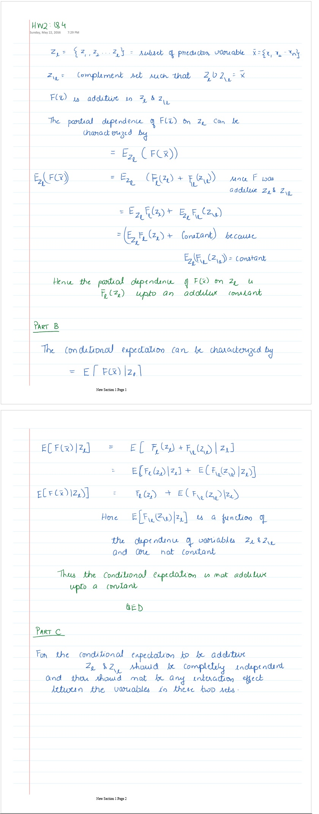

```{r setup, include=FALSE}
knitr::opts_chunk$set(cache=TRUE)
```

1. Q1 
  + Advantages:
    + Fast: Since only a subset of variables are selected, trees can be built comparitively (compared to full set tree with all variables) quickly
    + Parallizable: Each selection of subset of variables can be independent, hence trees for Random Forests can be calculated independently.
    + Less likely to overfit the data since in each iteration only a smaller set of variables are selected
    
  + Disadvantages:
    + Interpretability becomes difficult as only a subset of variables are selected for each iteration.
    + Addition of a new tunable parameter i.e the number of variables to be chosen. Performance will depend on the value of parameter.
    + Potentially more bias in construction of each tree as we only consider a subset of variables.
    
  + One can introduce additional tree variation in the forest by selecting a subset of training data in each iteration. The results are equivalent to randomly selecting subsets of variables.

2. Q2
  If number of predictors are greater than the number of observations in the training sample, then to an extent we have an ill-posed problem. Here are some of the challenges:
    + High variability in the estimates of risk when evaluated on different random samples
    + Some of the predictors are guaranteed not to not have any contribution in the sample points.

    
  + Regularization helps here by placing a restriction on the joint solution values. i.e it helps by constraining the number of variables chosen or the coefficients of variables chosen for building the functions.
  
  + Benefits of regularization
      + Regularization also will help when the output response is only dependent on few input parameters, but measurements of many extraneous variables are available.
      + Regularization also helps in minimizing the impact of noise.
  
  + Disadvantages of regularization:
      + Regularization requires prior knowledge e.g # of useful variables, # of variables with zero or near-zero coefficients. These parameters go in choosing the regularizing function. The priors could be easily be wrong. For e.g for best subset selection we have to choose the number of variables at each iteration. If the true number of dependent variables  are larger than the subsets we chose, the output will have a high error rate.
      
  + Sparsity is a reasonable assumption in boosting context because.. TBD
  
  + Is it always? Why why not?
  
  
3. +Q3
  
  
  
  
4. + Q4
  


5.  + Q5
  

6. Q6
  + 6a.
  
    ```{r}
    library(gbm)
    inspam=read.csv("Spam_Train.txt")
    spname<-c ("make", "address", "all", "3d", "our", "over", "remove",
              "internet","order", "mail", "receive", "will",
              "people", "report", "addresses","free", "business",
              "email", "you", "credit", "your", "font","000","money",
              "hp", "hpl", "george", "650", "lab", "labs",
              "telnet", "857", "data", "415", "85", "technology", "1999",
              "parts","pm", "direct", "cs", "meeting", "original", "project",
              "re","edu", "table", "conference", ";", "(", "[", "!", "$", "#",
              "CAPAVE", "CAPMAX", "CAPTOT","type")
    colnames(inspam)=spname
    
    
    set.seed(1)
    x=inspam[sample(nrow(inspam)),]
    
    set.seed(1)
    gbm0=gbm(type~.,data = x,interaction.depth = 4, shrinkage =0.001, n.trees=2500, cv.folds=5, distribution="bernoulli", verbose=F)
    gbm0.predict=predict(gbm0,x,type="response",n.trees = 300)
    trainresp=rep(0,length(gbm0.predict))
    trainresp[gbm0.predict>=0.5]=1
    conftable=table(trainresp, x$type)
    best.iter_train=gbm.perf(gbm0,method="cv")
    overallerror=(conftable[1,2]+conftable[1,2])/sum(conftable)
    nonspam_as_spam=(conftable[2,1])/sum(conftable[,1])
    spam_as_notspam=(conftable[1,2])/sum(conftable[,2])
    print(paste0("Overall Error Rate=",overallerror))
    print(paste0("Non-spam marked as spam=",nonspam_as_spam))
    print(paste0("Spam marked as not-spam=",spam_as_notspam))
    ```


```{r}
    
    set.seed(1)
    inspamtest=read.csv("Spam.Test.txt")
    spname<-c ("make", "address", "all", "3d", "our", "over", "remove",
              "internet","order", "mail", "receive", "will",
              "people", "report", "addresses","free", "business",
              "email", "you", "credit", "your", "font","000","money",
              "hp", "hpl", "george", "650", "lab", "labs",
              "telnet", "857", "data", "415", "85", "technology", "1999",
              "parts","pm", "direct", "cs", "meeting", "original", "project",
              "re","edu", "table", "conference", ";", "(", "[", "!", "$", "#",
              "CAPAVE", "CAPMAX", "CAPTOT","type")
    colnames(inspamtest)=spname
    w=inspamtest[sample(nrow(inspamtest)),]

    #Predicting using gbm from training
    gbm0.test.predict=predict(gbm0,w,type="response",n.trees = best.iter_train)
    trainresp1=rep(0,length(gbm0.test.predict))
    trainresp1[gbm0.test.predict>=0.5]=1
    conftable2=table(trainresp1, w$type)
    
    overallerror=(conftable2[1,2]+conftable2[1,2])/sum(conftable2)
    nonspam_as_spam=(conftable2[2,1])/sum(conftable2[,1])
    spam_as_notspam=(conftable2[1,2])/sum(conftable2[,2])
    print(paste0("Overall Error Rate=",overallerror))
    print(paste0("Non-spam marked as spam=",nonspam_as_spam))
    print(paste0("Spam marked as not-spam=",spam_as_notspam))
    
```


    + Misclassfication rates: Test Data
      + Overall=(20+7)/(909+20+7+597)=0.017
      + Non-spam marked as spam: 7/(909+7)=0.0076
      + Spam marked as non-spam: (20)/(20+597)=0.032

  + 6b. i
  
    ```{r}
    set.seed(1)
    wghts=rep(1,length(x$type))
    
    wghts[x$type==0]=25;
    gbm1=gbm(type~.,data = x,interaction.depth = 4, shrinkage =0.001, weights=wghts, n.trees=2500,cv.folds=5, distribution="bernoulli", verbose=F)
    
    best.iter_train=gbm.perf(gbm1,method="cv")
    gbm1.predict=predict(gbm1,w,type="response",n.trees = best.iter_train)
    trainresp1=rep(0,length(gbm1.predict))
    trainresp1[gbm1.predict>=0.5]=1
    conftable2=table(trainresp1, w$type)
    
    overallerror=(conftable2[1,2]+conftable2[1,2])/sum(conftable2)
    nonspam_as_spam=(conftable2[2,1])/sum(conftable2[,1])
    spam_as_notspam=(conftable2[1,2])/sum(conftable2[,2])
    print(paste0("Overall Error Rate=",overallerror))
    print(paste0("Non-spam marked as spam=",nonspam_as_spam))
    print(paste0("Spam marked as not-spam=",spam_as_notspam))
    
    ```
  
      + By giving more weight to missclassifcation of Non-Spam as a spam mail, the overall accuracy of the model is reduced however, we decreased the missclassification error due to a non-spam mail being marked as a spam mail.
  
  
  + 6b. ii
  
    ```{r}
    impvar=summary(gbm1)
    impvar[1:5,]
    ```
    
      + The 3 most important variables seems to be having following words in the spam email:
        + $ string (#53)
        + phrase: remove (#7)
        + ! exclamation mark. (#52)

  + 6b iii
  
    ```{r}
    par(mfrow=c(2,2))
    plot(x=gbm1, i.var=53, n.trees=best.iter_train, main="Partial Dependence  of '$'")
    plot(x=gbm1, i.var=7, n.trees=best.iter_train, main="Partial Dependence  of Phrase 'Remove'")
    plot(x=gbm1, i.var=52, n.trees=best.iter_train, main="Partial Dependence  of '!'")
    
```
   
    + There is a significant +ve correlation and mail having $ and probability of it being a spam email. This is also true for other two terms ie presence of "!" and word "Remove" has high correlation with the mail being a spam mail.
    
    ```{r}    
    par(mfrow=c(2,2))
    plot(gbm1, c(52,53),best.iter_train, main="Partial Dependence  of '!' and '$'")
    plot(gbm1, c(7,53),best.iter_train, main="Partial Dependence  of 'remove' and '$'")
    plot(gbm1, c(7,52),best.iter_train, main="Partial Dependence  of 'remove' and '!'")
    ```
  
    + The plots with 2 variables indicates that
      + Lower frequency of '!' has high indication of being a spam and seems to be independent of the frequency of occurence of '$' in mails
      + Lower frequency of word 'remove' has high indication of being a spam and seems to be independent of the frequency of occurence of '$' in mails
      + Lower frequency of word 'remove' has high indication of being a spam and seems to be independent of the frequency of occurence of '!' in mails
      

7.

  + 7a.
  
    
    ```{r}
    inpcal=read.csv("California_Data.txt")
    calname=c("hval","inc","hage","#rooms","#bed","pop","occu","lat","long")
    colnames(inpcal)=calname
    set.seed(1)
    inpcal=inpcal[sample(nrow(inpcal)),]
    
    set.seed(1)
    gbmcal0=gbm(hval~.,data=inpcal, train.fraction=0.8, interaction.depth = 4, shrinkage = 0.001, n.trees=2500, cv.folds=5, distribution = "gaussian", verbose=F)

    best.iter=gbm.perf(gbmcal0,method="test")
    gbmcal0.predict=predict(gbmcal0,inpcal,n.trees = best.iter)
    
    # Error:
    mean((gbmcal0.predict-inpcal$hval)^2)
    print(paste0("Traning Error=",mean((gbmcal0.predict-inpcal$hval)^2)))
    ```

    + For this exercise, I have divided the data in to Test and training set. The gbm model is trained on the training set.
    + Training set Error is 0.459

  + 7b.
  
```{r}
    par(mfrow=(c(1,1)))
    impvar=summary(gbmcal0)
    impvar[1:5,]
```
  
    + Most important factors of influence on housing prices are:
      + Median Income of the block/neighborhood
      + Average occupancy
      + Longitude of the house location.
  
  + 7c.
  
```{r}
    par(mfrow=c(2,2))
    plot(x=gbmcal0, i.var=1, n.trees=best.iter, main="Partial Dependence  of 'Income'")
    plot(x=gbmcal0, i.var=6, n.trees=best.iter, main="Partial Dependence  of 'Number of Occupants")
    plot(x=gbmcal0, i.var=8, n.trees=best.iter, main="Partial Dependence  of 'Longitude'")
```
  
    + Housing value is influenced by Median income of the block. Higher median income indicates that house values are lower.
    + Average occupancy is negatively correlated with house value. Higher average occupance indicates lower house values are lower.
    + California's location is around 124'W to 114'W. As we go move east, the housing prices decreases. This effect may be because, houses are more expensive near the California coast and cheaper in the inlands.
    
  
    
```{r}
    par(mfrow=c(2,2))
    plot(x=gbmcal0,c(1,6), n.trees=best.iter, main="Partial Dependence  of Income and Number of Occupants")
    plot(x=gbmcal0, c(1,8), n.trees=best.iter, main="Partial Dependence  of Income and Longitude")
    plot(x=gbmcal0, c(8,6), n.trees=best.iter, main="Partial Dependence  of Number of occupants and Longitude")

```
  
    + Lower Median income is a strong indicator for the Housing value and seems to be indpendent of the average occupancy in the region.
    + Lower Median income is a strong indicator for the Housing value and seems to be indpendent of longitudinal position in the region.
    + Eastwards Longitudinal position seems to be a stronger indicator of housing value  and seems to be independent of the average occupancy of the house
  
8. Q8

  + 8a.

```{r}
    Income=read.csv("Income_Data.txt")
    ModIncome=data.frame(Inc=Income$X9,sex=Income$X2,marital=Income$X1,age=Income$X5,edu=Income$X4,occ=Income$X5.1,dwelltime=Income$X5.2,dual=Income$X3,hh=Income$X3.1,hh18=Income$X0,house=Income$X1.1,hometype=Income$X1.2,Ethnic=Income$X7,lang=Income$NA.)
    
    Inc=ModIncome$Inc
    sex=factor(ModIncome$sex, levels=1:2, labels=c("Male","Female"))
    marital=factor(ModIncome$marital, levels=1:5,labels=c("Married","live-in","Divorced","Seperated","Single"))
    age=factor(ModIncome$age,levels=1:7,labels=c("14-17","18-24","25-34","35-44","45-54","55-64","over 65"))
    edu=factor(ModIncome$edu,levels=1:6,labels=c("less grade 8","grade 9-11","grad high","1-3 college","College grad","Grad"))
    occ=factor(ModIncome$occ,levels=1:9,labels=c("Professional","Sales","laborer","Clerk","Home","Student","Military","Retired","Unemployed"))
    dwelltime=factor(ModIncome$dwelltime,levels=1:5,labels=c("<1year","1-3 years","4-6 years","7-10 years",">10 years"))
    dual=factor(ModIncome$dual, levels=1:3, labels=c("Not Married","Yes","No"))
    hh=factor(ModIncome$hh, levels=1:9, labels=c("1","2","3","4","5","6","7","8",">9"))
    hh18=factor(ModIncome$hh18, levels=1:9, labels=c("1","2","3","4","5","6","7","8",">9"))
    house=factor(ModIncome$house, levels=1:3, labels=c("Own","Rent","Live with family"))
    hometype=factor(ModIncome$house,levels=1:5, labels =c("House","Condo","Apa","Mobile","Other"))
    ethnic=factor(ModIncome$Ethnic, levels=1:8, labels=c("American Ind","Asian","Black","East indian","Hispanic","Pacific Island","White","Other"))
    lang=factor(ModIncome$lang,levels=1:3, labels=c("English","Spanish","Other"))
    
    FinalInc=data.frame(Inc=Inc,sex=sex,marital=marital,age=age,edu=edu,occ=occ, dwelltime=dwelltime, dual=dual, hh=hh, hh18=hh18,house=house, hometype=hometype,ethnic=ethnic, lang=lang)
    
    FinalInc=FinalInc[sample(nrow(FinalInc)),]
    
    set.seed(1)
    gbminc0=gbm(Inc~.,data=FinalInc, train.fraction=0.8, bag.fraction=0.5, interaction.depth = 4, shrinkage = 0.01, n.trees=2500, cv.folds=5, distribution = "gaussian", verbose=F)

    best.iter=gbm.perf(gbminc0,method="test")
    gbminc0.predict=predict(gbminc0,FinalInc,type="response", n.trees =best.iter)
    
    gbminc0.round=round(gbminc0.predict)
    
    # Error:
    mean((gbminc0.predict-FinalInc$Inc)^2)
    print(paste0("Boosting Error=",mean((gbminc0.predict-FinalInc$Inc)^2)))
    
    
    #RPart tree error
    library(rpart)
    #Optimal tree was a tree with 18 nodes with cp=0.00199
    incfit=rpart(Inc~.,FinalInc, cp=0.00199)
    #summary(incfit)
    
    print(paste0("Error using trees:",7.69*0.5236 ))    
```
   
    + MSE Error with Boosting: 3.363
    + MSE Error with Trees: 4.02
    + Boosting is doing beter than Trees in in this instance

  + 8b.
  
```{r}
    summary(gbminc0)
```
   
   
    + The most important variables to predict income seems to be:
      + If the person owns the house or rents it or live with family.
      + Age of the person
      + Occupation
      
    + It is not inconsistent with national average results. Couple of possible reasons:
      + It could be very well that after adjustment to the critical factors mentioned here, women get paid less than men. i.e if a man and a woman have the same home ownership, age, occupation etc, men might still get paid higher. 
      + Other possible reason could be that data from San-Francisco might not be representative of the national average data. San-Francisco is primarily tech based industry where the disparity between men/women salaries are less disparate than in other fields.


9.

  + 9a.
```{r}

Income=read.csv("Occupation_Data.txt")
  incnames<-c ("occ", "hometype", "sex", "marital", "age", "edu", "Inc",
              "dwelltime","dual", "hh", "hh18", "house",
              "ethnic", "lang")

    ModIncome=Income
    colnames(ModIncome)=incnames
    
    Inc=factor(ModIncome$Inc, levels=1:9, labels=c("<10K","10-15K","15-20K","20-25K","25-30K","30-40K","40-50K","50K-75K",">75K"))
    sex=factor(ModIncome$sex, levels=1:2, labels=c("Male","Female"))
    marital=factor(ModIncome$marital, levels=1:5,labels=c("Married","live-in","Divorced","Seperated","Single"))
    age=factor(ModIncome$age,levels=1:7,labels=c("14-17","18-24","25-34","35-44","45-54","55-64","over 65"))
    edu=factor(ModIncome$edu,levels=1:6,labels=c("less grade 8","grade 9-11","grad high","1-3 college","College grad","Grad"))
    occ=factor(ModIncome$occ,levels=1:9,labels=c("Professional","Sales","laborer","Clerk","Home","Student","Military","Retired","Unemployed"))
    dwelltime=factor(ModIncome$dwelltime,levels=1:5,labels=c("<1year","1-3 years","4-6 years","7-10 years",">10 years"))
    dual=factor(ModIncome$dual, levels=1:3, labels=c("Not Married","Yes","No"))
    hh=factor(ModIncome$hh, levels=1:9, labels=c("1","2","3","4","5","6","7","8",">9"))
    hh18=factor(ModIncome$hh18, levels=1:9, labels=c("1","2","3","4","5","6","7","8",">9"))
    house=factor(ModIncome$house, levels=1:3, labels=c("Own","Rent","Live with family"))
    hometype=factor(ModIncome$house,levels=1:5, labels =c("House","Condo","Apa","Mobile","Other"))
    ethnic=factor(ModIncome$Ethnic, levels=1:8, labels=c("American Ind","Asian","Black","East indian","Hispanic","Pacific Island","White","Other"))
    lang=factor(ModIncome$lang,levels=1:3, labels=c("English","Spanish","Other"))
    
    FinalInc=ModIncome
    
    train=sample(1:nrow(FinalInc),7000)
    test=-train
    
    Finalocc.train=FinalInc[train,]
    Finalocc.test=FinalInc[test,]
    
    set.seed(1)
    gbmocc0=gbm(occ~.,data=Finalocc.train, bag.fraction=0.5, interaction.depth = 4, shrinkage = 0.01, n.trees=2500, cv.folds=5, distribution = "multinomial", verbose=F)

    best.iter=gbm.perf(gbmocc0,method="cv")
    
    #Predict on the test data
    gbmocc0.predict=predict(gbmocc0,Finalocc.test,type="response", n.trees =best.iter)

    #Assign the class with maximum probability:
    pred.occ=apply(gbmocc0.predict,1,which.max)
    
    # Error:
    actual.occ=Finalocc.test$occ
    occ.table=table(actual.occ, pred.occ)
    
    #Classficiation Error
    print(paste0("Overall Misclassification rate",1-sum(diag(occ.table))/sum(occ.table)))
    
    #Misclassification for each class
    print(paste0("Misclassification rate for Professional/Managerial",1-occ.table[1,1]/sum(occ.table[1,]) ))
    print(paste0("Misclassification rate for Sales Worker",1-occ.table[2,2]/sum(occ.table[2,]) ))
    print(paste0("Misclassification rate for Factory worker/Laborer/Driver",1-occ.table[3,3]/sum(occ.table[3,]) ))
    print(paste0("Misclassification rate for Clerical/Service Worker",1-occ.table[4,4]/sum(occ.table[4,]) ))
    print(paste0("Misclassification rate for Homemaker",1-occ.table[5,5]/sum(occ.table[5,]) ))
    print(paste0("Misclassification rate for Student/HS or College",1-occ.table[6,6]/sum(occ.table[6,]) ))
    print(paste0("Misclassification rate for Military",1-occ.table[7,7]/sum(occ.table[7,]) ))
    print(paste0("Misclassification rate for retired",1-occ.table[8,8]/sum(occ.table[8,]) ))
    print(paste0("Misclassification rate for Unemployed",1-occ.table[9,9]/sum(occ.table[9,]) ))
    
    

```
  
  + 9b.

```{r}
  summary(gbmocc0)
```

  + Most important variables as an indicator for Occupation
    + Age:
    + Education:
    + Income
