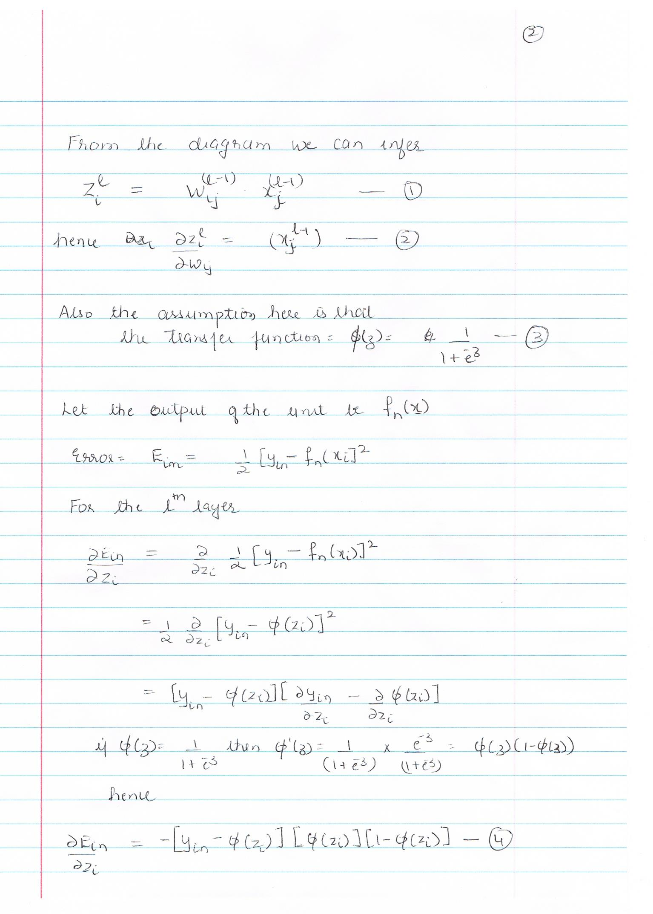

```{r setup, include=FALSE}
knitr::opts_chunk$set(cache=TRUE)
```


1. Q1

  
  
  
  


2. Q2

  
  
  

3. Q3

  

4. Q4

  

5. Q5. 
  
    + 5a.
    
```{r}

library(nnet)

inspam=read.csv("Spam_Train.txt")
spname<-c ("make", "address", "all", "3d", "our", "over", "remove",
              "internet","order", "mail", "receive", "will",
              "people", "report", "addresses","free", "business",
              "email", "you", "credit", "your", "font","000","money",
              "hp", "hpl", "george", "650", "lab", "labs",
              "telnet", "857", "data", "415", "85", "technology", "1999",
              "parts","pm", "direct", "cs", "meeting", "original", "project",
              "re","edu", "table", "conference", ";", "(", "[", "!", "$", "#",
              "CAPAVE", "CAPMAX", "CAPTOT","type")
colnames(inspam)=spname
x=inspam
colnames(x)=spname
x$type=as.factor(inspam$type)
x[,1:57]=scale(x[,1:57], center=TRUE, scale=TRUE)
x=data.frame(x)
colnames(x)=spname


inspamtest=read.csv("Spam.Test.txt")
colnames(inspamtest)=spname
w=inspamtest
colnames(w)=spname
w$type=as.factor(as.factor(inspamtest$type))
w[,1:57]=scale(w[,1:57],center=TRUE, scale=TRUE)
w=data.frame(w)
colnames(w)=spname
w.type=w$type

#Find the size with minimum error
set.seed(1)
for(i in 1:10){  
  nn1=nnet(type~.,data=x, size=i, maxit=5000, decay=0.0, rang=0.5, trace=F)
  nn1.predict=predict(nn1, newdata = w,type="class") 
  nn1.out=nn1.predict
  u=matrix(data=0,2,2)
  u=table(nn1.out, w.type)
  err=sum(nn1.out!=w.type)/(length(nn1.out))
  print(paste0("# of hidden nodes = ",i," and error = ", err))
}

print(paste0("Minimum Error is with # of hidden nodes = ", 8))
```


      + By using a # of hidden nodes as 8, we get  overall error rate ~4-5%

  + 5b. 

```{r}
set.seed(1)
res=matrix(NA, length(nn1.out),11)
ii=1;
for(j in seq(0,1,0.1)){  
  nn1=nnet(type~.,data=x, size=8, maxit=5000, decay=j, rang=-0.5, trace=F)
  nn1.predict=predict(nn1, newdata = w[,1:57],type="class") 
  nn1.out=nn1.predict
  res[,ii]=nn1.out
  ii=ii+1;
  err=sum(nn1.out!=w.type)/(length(nn1.out))
  print(paste0("Decay = ",j," and error = ", err))
}

print(paste0("Minimum Error is with value of decay as = ", 0.6))

nn1=nnet(type~.,data=x, size=8, maxit=5000, decay=0.6, rang=-0.5, trace=F)
nn1.best=predict(nn1, newdata = w[,1:57],type="class") 

#Finding the class through majority vote:
vote=rep(NA,length(nn1.out))
for (i in 1:length(nn1.out)){
  if(sum(res[i,]==1)>sum(res[i,]==0))
  {vote[i]=1}
  else{
    vote[i]=0
  }
}

#Calcualte error
err=sum(vote!=w.type)/(length(nn1.out))
print(paste0("Error using the majority of votes is  ", err))
```


      + Best Model:
        + Decay: 0.6
        + Number of hidden units: 8
        + Error:~3-4%
      
      
      + By using an ensemble, where we find majority of votes for a class, the error is about 4%
      


  + 5c.
  
```{r}
set.seed(1)
for(k in seq(0,1,0.1)){  
      nn1=nnet(type~.,data=x, size=8, maxit=5000, decay=0.6, trace=F)
      nn1.predict=predict(nn1, newdata = w,type="raw") 
      nn1.out=rep(0,length(nn1.predict))
      nn1.out[nn1.predict>k]=1
      u=matrix(data=0,2,2)
      u=table(w.type,nn1.out)
   
      print(paste0("Threshold= ", k , " Proportion of good mails misclassified is: ", u[3][1]/(u[1][1]+u[3][1]) ))
}
```


      + By using a Threshold of 90% of classifiying an email as spam, we can get misclassification of good email as spam down to <1% error rate.
